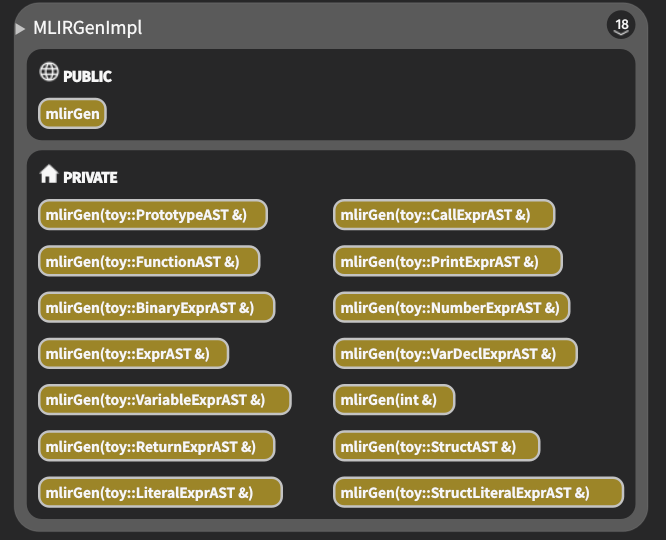
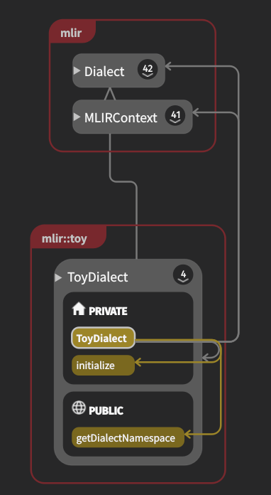

#! https://zhuanlan.zhihu.com/p/441237921
# MLIR-Toy-实践-1-添加Op

向toyDialect中添加新的op，添加一个OrOp，支持按照Tensor元素执行或操作。

```
def main() {
  # Define a variable `a` with shape <2, 3>, initialized with the literal value.
  # The shape is inferred from the supplied literal.
  var a = [[1, 2, 3], [4, 5, 6]];
  # b is identical to a, the literal array is implicitly reshaped: defining new
  # variables is the way to reshape arrays (element count in literal must match
  # the size of specified shape).
  var b<2, 3> = [1, 2, 3, 4, 5, 6];

  # add a new operation Or
  var c = a | b;
}
```

## 源码到AST
为toy语言新加入一个Op支持，首先要能够支持解析为AST；需要经过词法分析lexer和语法分析parser两个过程；

lexer支持:

lexer实现在`mlir/mycode/Ch2/include/toy/Lexer.h`中，新加入的操作符`|`在词法分析阶段被当作`Identifier`处理，并不需要新添加支持。

parser支持：

parser实现在`mlir/mycode/Ch2/include/toy/Parser.h`中，新加入的`|`操作需要被解析为`BinaryOp`, 该操作在`parseBinOpRHS()`中实现，需要在`getTokPrecedence()`中加入对`|`操作符的支持，参考c语言运算符优先级，`|`操作优先级低于`+`,`-`操作：
```
int getTokPrecedence() {
    // ...
    // 1 is lowest precedence.
    switch (static_cast<char>(lexer.getCurToken())) {
    case '|':
      return 10;
    case '-':
      return 20;
    case '+':
      return 20;
    case '*':
      return 40;
    default:
      return -1;
    }
  }
```

AST支持：

ast实现在`mlir/mycode/Ch2/include/toy/AST.h`，新加入的`|`操作需要被解析为AST中的二元操作符`BinaryExprAST`，新加入的`|`操作和`+`等二元操作符在仅是AST节点的操作符`op`有区别，该部分实现也不需要做改动。

## MLIR Op构建
MLIR是一种图类型的IR表示，核心是节点Node和边Edge。在MLIR中节点是Operation，边是Values，这里的value可以是Operation的结果或者Block的参数（Block通常是多个不含分支的Operation构成）。新加的操作最终需要构建为MLIR中的一个Operation节点。关于MLIR更详细的内容可以参看官网的[LanguageReference](https://mlir.llvm.org/docs/LangRef/)。


MLIR提供了一套基于tablegen的Op实现框架[`ODS`](https://mlir.llvm.org/docs/OpDefinitions/)。由于MLIR支持各种自定义的Dialect，如果各种Dialect的构造器和参数等内容缺乏一些共识，会导致碎片化非常严重，Dialect转换成本会很高。采用表驱动（tablegen）的方式定义Dialect的核心内容，自动化生成接口代码可以减少工作量，同时达到一定程度“标准化”的效果。


`ODS`框架中提供了一套自己的语法来定义`Dialect`和`Op`，可以通过tablegen生成对应类的C++代码。定义OP主要需要定义的内容包括`arguments`、`results`、`verifier`、`builders`、`doc`等。参考`AddOp`的实现，添加`OrOp`操作也很简单：
```
def OrOp : Toy_Op<"Or"> {
  let summary = "element-wise logic Or operation";
  let description = [{
    The "or" operation performs element-wise logic or between two tensors.
    The shapes of the tensor operands are expected to match.
  }];

  let arguments = (ins F64Tensor: $lhs, F64Tensor:$rhs);
  let results = (outs F64Tensor);

  // 构建一个MLIR Operation节点
  let builders = [
    OpBuilder<(ins "Value":$lhs, "Value":$rhs)>
  ];
}
```
一个Op的定义：通过`arguments`指定输入，通过`results`指定输出，然后可以通过`builders`来指定构建一个MLIR Operation节点的方法。这里以`argument`的构建为例，说明各个表项的定义：
```
let arguments = (ins
  <type-constraint>:$<operand-name>,
  ...
  <attr-constraint>:$<attr-name>,
  ...
);
```
上文中的`F64Tensor`对应`<type-constraint>`，`$lhs`对应`$<operand-name>`，另外还可以添加一些属性的约束；更为详细的说明可以参考[OPS文档](https://mlir.llvm.org/docs/OpDefinitions/)。

到此就可以实现将toy语言中的`|`操作符对应为MLIR中ToyDialect的一个Operation节点，可以编译验证一下：
```bash
# 编译
cmake --build . --target toyc-ch2
# 验证
./bin/toyc-ch2 ../../testcode/Ch2/ast.toy --emit=mlir
```

## AST转换为MLIR
toy文件通过lexer和parser转换为AST后，需要转换MLIR表示，转换过程在`mlir/mycode/Ch2/mlir/MLIRGen.cpp`中实现。



该文件中定义了针对不同AST节点的`mlirGen`函数，为不同的AST node建立对应的MLIR Operation。

## 将Op添加到Dialect中
最终生成的Op在Dialect初始化阶段将Op注册到方言中：



具体实现代码如下：
```
void ToyDialect::initialize() {
  addOperations<
#define GET_OP_LIST
#include "toy/Ops.cpp.inc"
      >();
}
```
这里将ODS生成的Op添加到Dialect中。

## Tips
* AST解析支持了减法操作，但是目前toy对应的MLIR Op中并没有定义减法Op，感兴趣可以把支持减法当作练习。